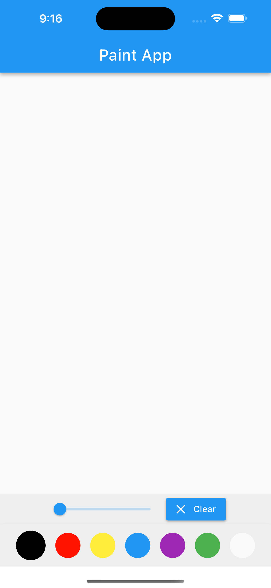
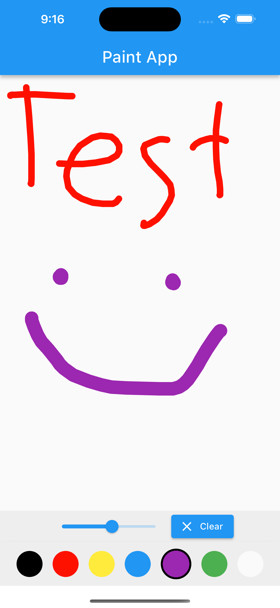
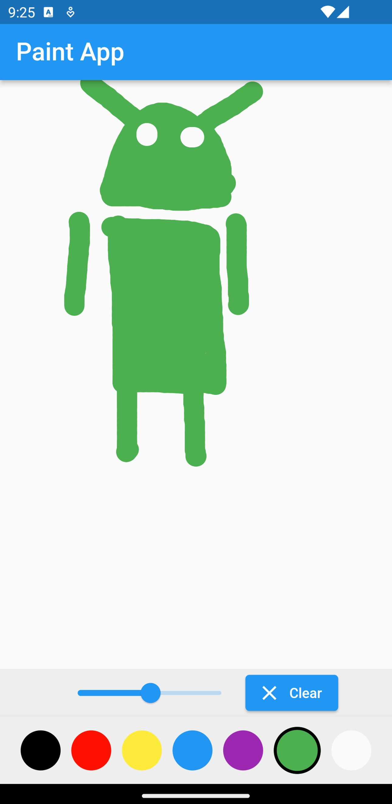

# Paint App

This is a painting app for iOS, Android, Web, Windows, Linux, and macOS. This was made in [Flutter 3.10.2](https://docs.flutter.dev/). 

| Initial Screenshot | In Use Screenshot | Android |
| ------------------ | ----------------- | ------- |
|  |  |  |
|                                     |                                    |                                     |

This app is separated into three parts: the canvas, the color picker, and the pen adjuster.

## Canvas
The canvas allows for the user to draw using the touch controls of their device or the mouse. It works by creating many instances of DrawingPoint as defined in `drawing_painter.dart` that are connected by drawing lines between the different instances in the `paint` method as defined in `drawing_painter.dart`.

## Color Picker
The color picker allows the user to pick between the colors black, red, yellow, blue, purple, green, and white. The white color allows the user to easily erase minor mistakes.

Each dot in the color picker is created from the `_buildColorPicker` method in `main.dart`. Any colors can be added or removed by modifying the `colors` list in `main.dart`.

## Pen Adjuster
The pen adjuster contains a slider for controlling the pen thickness, and also contains a button to clear the canvas.

## Inspiration
The canvas part of this app was largely sourced from [this video](https://www.youtube.com/watch?v=HI-PL37MdRM). The color picker and the pen adjuster have been adjusted by myself.